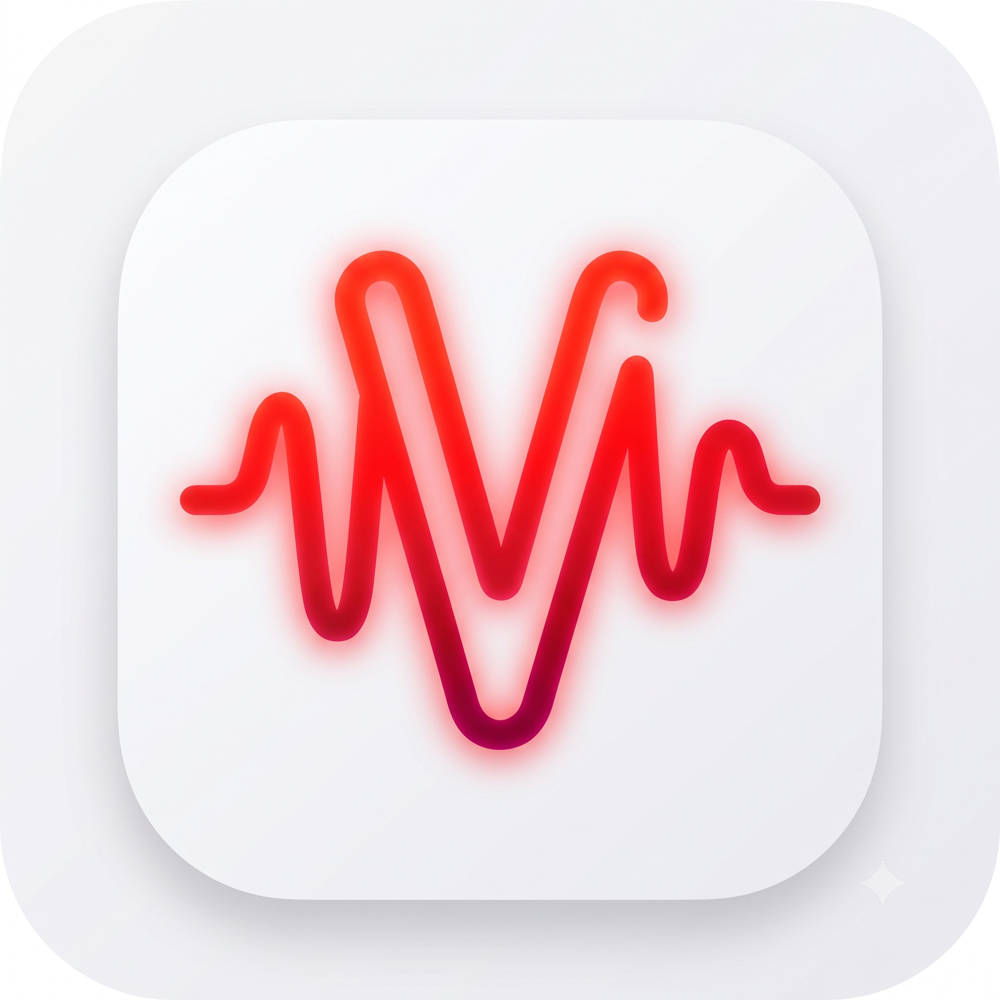
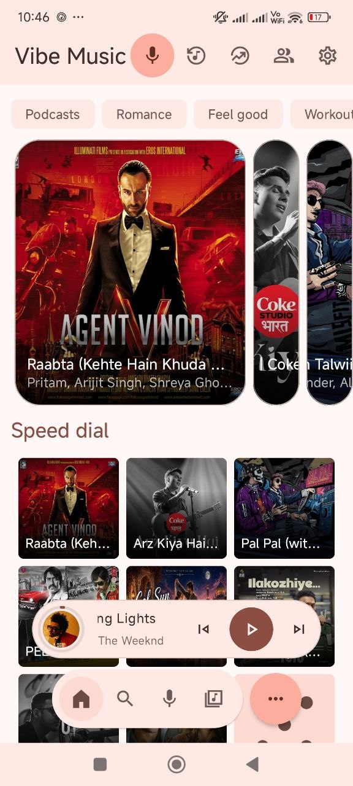
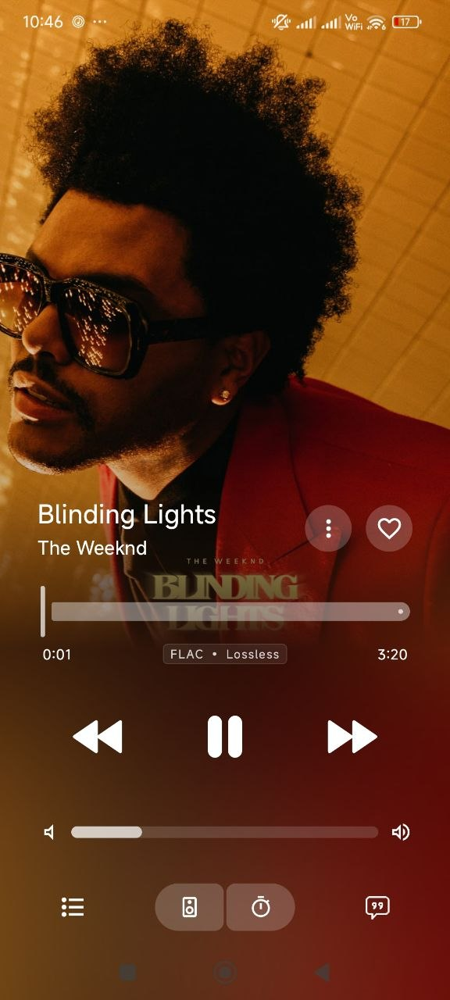
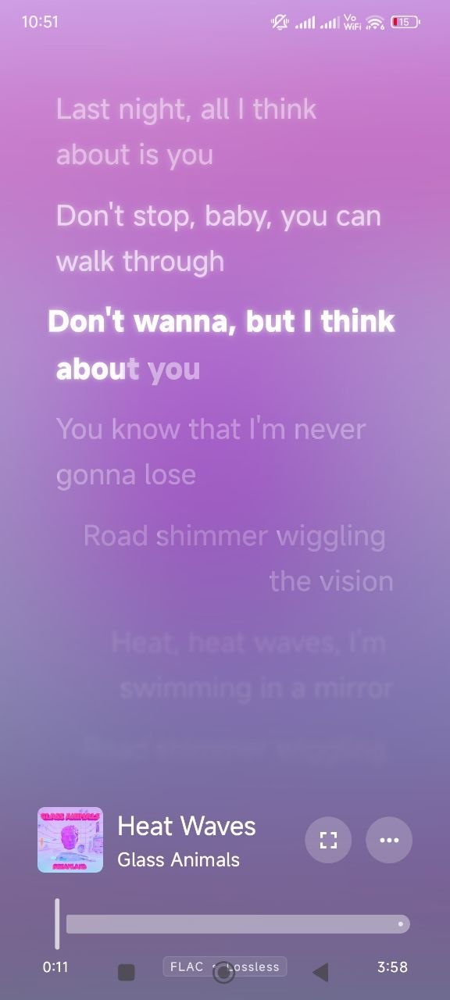
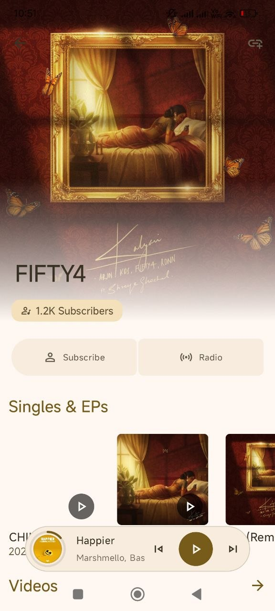
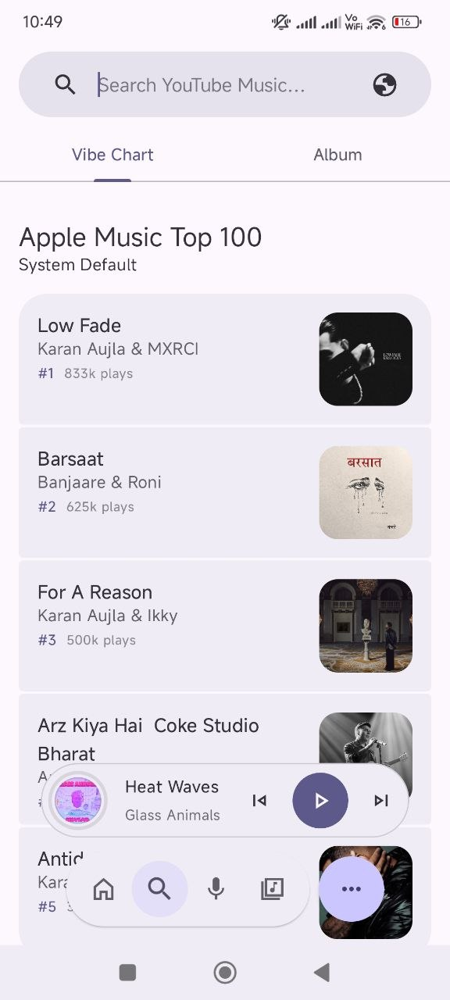
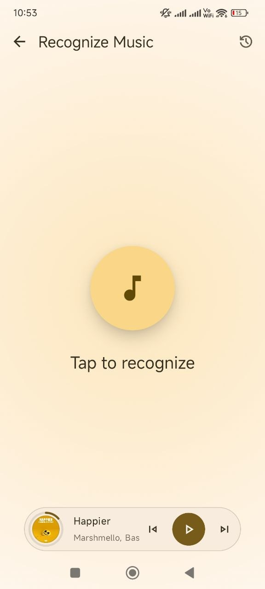
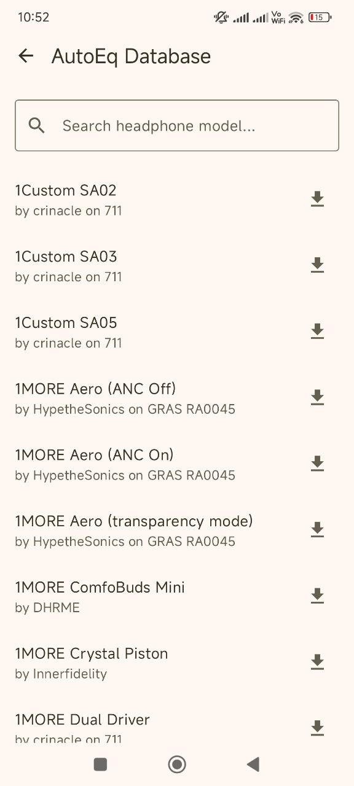
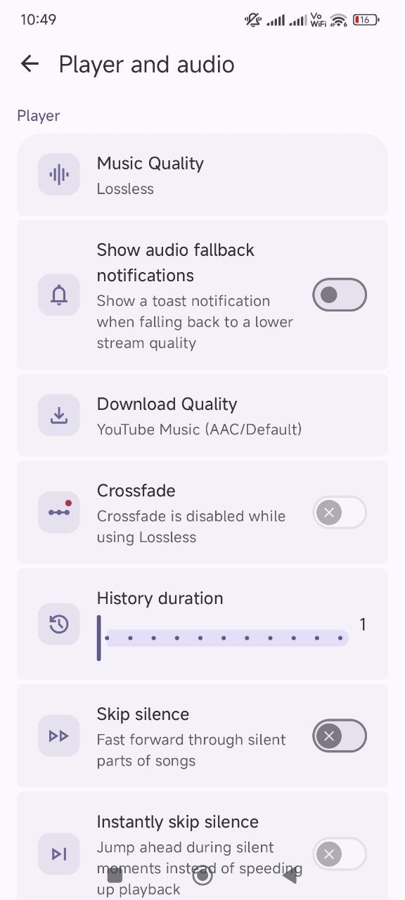
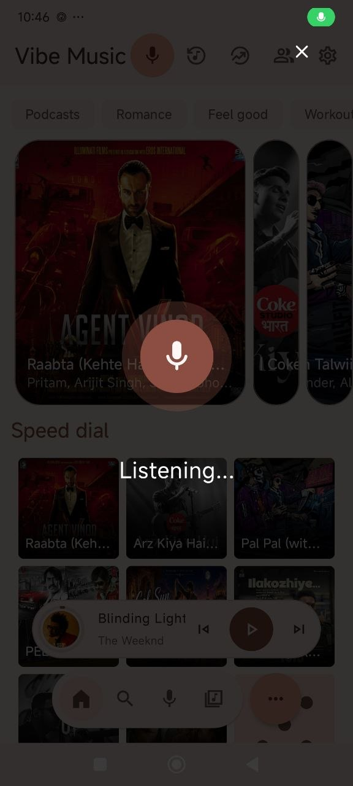

@ -0,0 +1,191 @@

  

<h1 align="center">Vibe Music</h1>

  <b>A Modern, Open-Source Android Music Player for Audiophiles & Power Users</b>

  
  
  
  
  

  Stream in high fidelity · Sync playback with friends in real-time · Control your library across your entire ecosystem 
  All wrapped in a stunning, highly animated UI.

---

## 📸 Screenshots

  
  &nbsp;&nbsp;
  
  &nbsp;&nbsp;
  
  &nbsp;&nbsp;
  

  
  &nbsp;&nbsp;
  
  &nbsp;&nbsp;
  
  &nbsp;&nbsp;
  

  

---

## ✨ Key Features

| Feature | Description |
|---|---|
| 🤖 **Vibee AI Assistant** | A built-in, intelligent assistant to help you discover music, manage your queue, and elevate your listening experience. |
| 👥 **Listen Together** | Flawless, real-time playback synchronization with friends using a custom low-latency WebSocket & SSE engine. |
| 🎧 **High-Fidelity Streaming** | Stream ad-free from Saavn (320 kbps) & YouTube in top-tier audio quality, including FLAC Lossless. |
| 🎛️ **Parametric Auto EQ** | Tailor your sound with built-in AutoEQ support featuring thousands of headphone profiles. |
| 🔀 **Smart Shuffle & Infinite Playback** | Analyze your queue's vibe to inject recommended tracks seamlessly, plus Automix & Daily Discover. |
| 🎨 **Liquid Glass UI & Visualizer** | Stunning translucent aesthetic with premium micro-animations and a real-time reactive audio visualizer. |
| 🚗 **Ecosystem Ready** | Full native support for Android Auto and Wear OS. |
| 🔊 **Native Cast Volume Sync** | Control Google Cast device volume directly via your phone's hardware buttons. |
| 💾 **Offline Local Backup** | Export and import playlists, history, and settings seamlessly via local JSON payloads. |
| 🎤 **Music Recognition** | Identify any song playing around you with a single tap — powered by ShazamKit. |
| 📝 **Synced Lyrics** | Beautiful, real-time synced lyrics with gradient backgrounds that match the album art. |
| 📊 **Vibe Charts** | Browse Apple Music Top 100 and curated charts right inside the app. |
| ⚡ **Quality-of-Life** | Swipe-to-queue, customizable home screen widgets, crossfade, skip silence, and "Recently Played" integration. |

---

## 🎬 App Preview

  

---

## 🏗️ Architecture & Under-the-Hood

Vibe Music is built entirely in **Kotlin** using **Jetpack Compose** and **Media3 (ExoPlayer)**.

### Multiplayer Synchronization

The multiplayer feature was architecturally designed from the ground up for low-latency, real-time sync:

- **`ListenTogetherManager`** — Intercepts Media3 player events to orchestrate playback state, timeline discontinuities, and seek events across all clients seamlessly.
- **`ListenTogetherClient`** — Real-time networking powered by OkHttp WebSockets and Server-Sent Events (SSE) for robust room administration and low-latency signaling.
- **Deep Service Integration** — `MusicService` exposes raw player lifecycle hooks directly to the sync orchestrator.
- **Compose Injection** — The multiplayer manager is wired into the core dependency graph and exposed via `CompositionLocal` in `MainActivity` for frictionless UI control.

---

## ⚙️ Installation

You can download the latest stable release directly from the [**GitHub Releases**](../../releases) page.

1. Navigate to the **Releases** section of this repository.
2. Download the latest **`vibe-music-release.apk`**.
3. Install the APK on your Android device.
   > **Note:** Ensure *"Install from Unknown Sources"* is enabled in your device settings.

---

## 🤝 Community & Support

  
  &nbsp;&nbsp;&nbsp;&nbsp;
  

---

## ☕ Support the Project

If you love Vibe Music, consider supporting its development:

  

<b>🇮🇳 UPI Donation</b>

 

  
   
  <a href="upi://pay?pa=dev.atharv@fam&pn=Atharv&am=100&cu=INR&tn=Donation%20to%20Vibe%20Music&tr=ORDER123">
    <b>Click here to Pay via UPI (₹100)</b>
  </a>
   
  UPI ID: <code>dev.atharv@fam</code>

---

## 🔐 Privacy & Security

- [**Privacy Policy**](PRIVACY_POLICY.md)
- [**Security Policy**](SECURITY.md)

---

## 📜 License

Vibe Music is **free and open-source software (FOSS)**.
## Legal Disclaimer & Terms of Use

### 1. 100% Free, Open-Source & Strictly Non-Commercial
Vibe Music is a fully open-source project (FOSS) created purely for educational purposes and personal use. We do not sell this application, nor do we monetize it in any way. There are no advertisements, no premium features, no subscriptions, and no hidden fees within the app. This project has absolutely no commercial value or financial intent.

### 2. A Custom Browser with Content Filtering
Vibe Music acts strictly as a specialized, third-party web browser and client. It simply parses the publicly available website content and APIs of YouTube and YouTube Music, rendering them in a custom user interface. The ad-free experience it provides is fundamentally no different from using a standard web browser (like Chrome, Firefox, or Brave) equipped with a common ad-blocking extension (such as uBlock Origin).

### 3. Support Content Creators
We deeply respect the hard work of artists, musicians, and content creators. We strongly encourage all users to subscribe to [YouTube Premium](https://www.youtube.com/premium). Purchasing a Premium subscription is the best way to financially support the creators you listen to and ensure the continued growth of the platform. Vibe Music is built as a proof-of-concept for developers and enthusiasts, not to harm creators' revenues.

### 4. No Hosting of Copyrighted Material
We do not host, upload, distribute, or store any audio, video, or copyrighted media files on our own servers. All content accessed through this application is stored entirely on Google's/YouTube's servers and remains the property of their respective copyright owners. The app merely acts as a conduit to stream publicly accessible links.

### 5. User Responsibility & Legal Contact
The software is provided "AS IS", without warranty of any kind. The developers of Vibe Music do not encourage or condone piracy. Users are solely responsible for ensuring their usage of this app complies with their local copyright laws and the Terms of Service of the platforms they access.

Because we do not host any media files, we cannot process DMCA takedown requests for audio or video content. However, if you represent a copyright holder or have legal concerns regarding the open-source code itself, please contact us via email at: [hello@iam4tharv.cyou](mailto:hello@iam4tharv.cyou)

---

  
Licensed under <a href="LICENSE">GPL-3.0</a>

---

  
   
  Made with ❤️ for music lovers everywhere.

