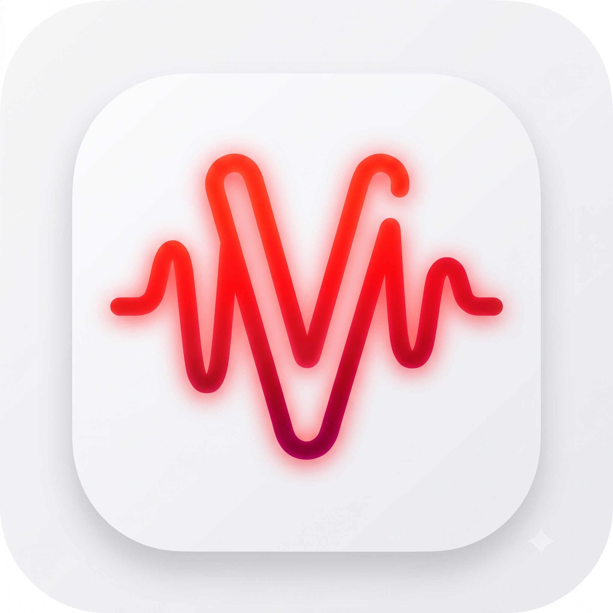
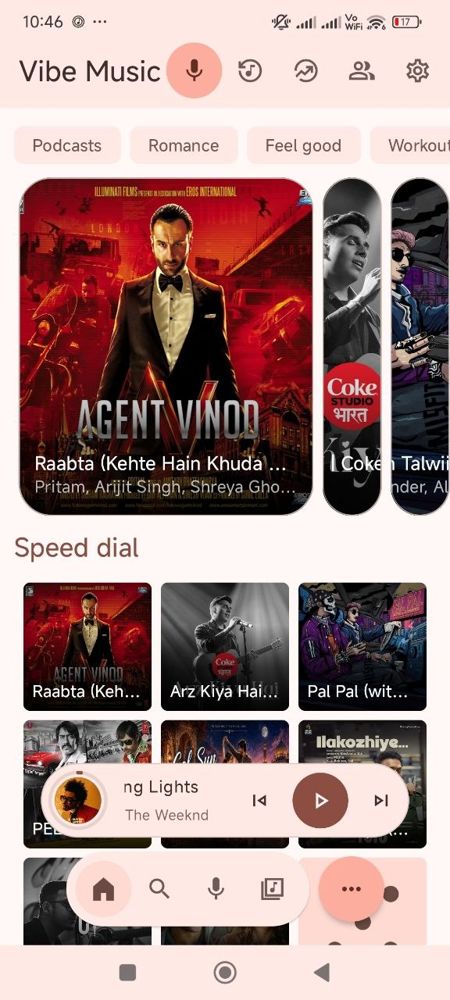
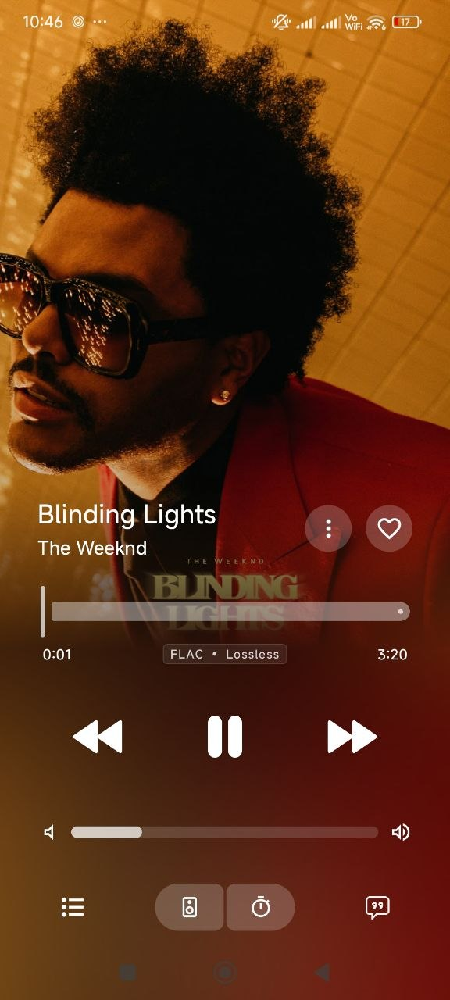
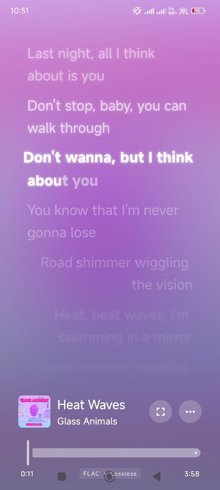
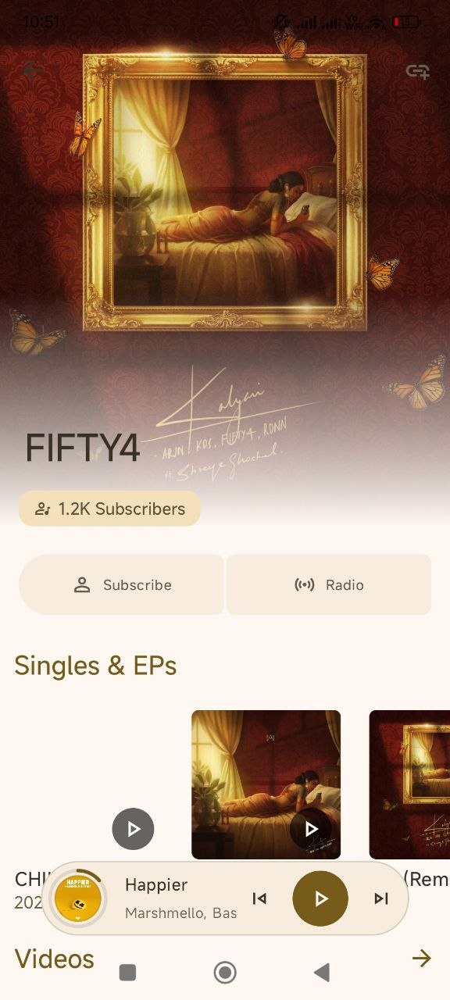
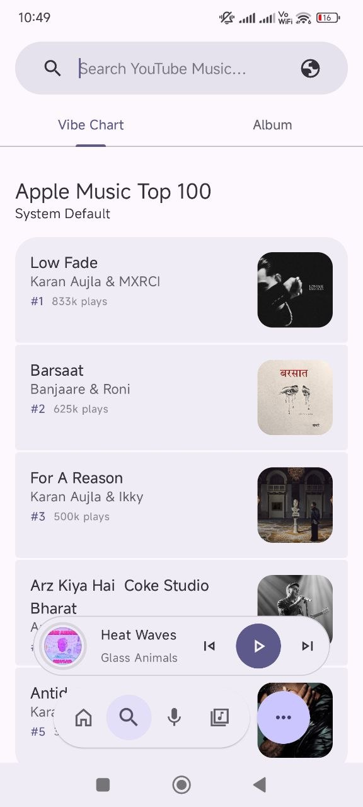
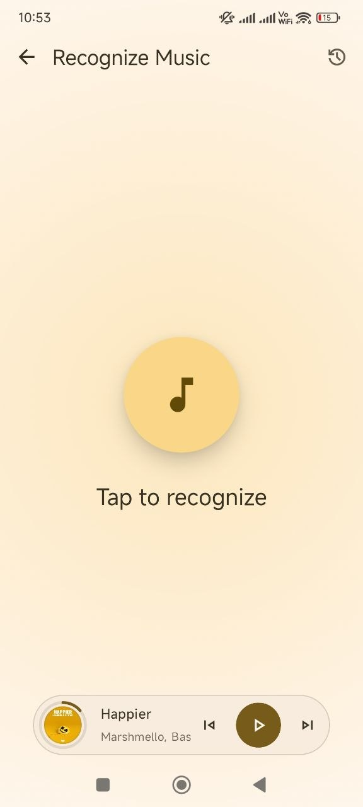
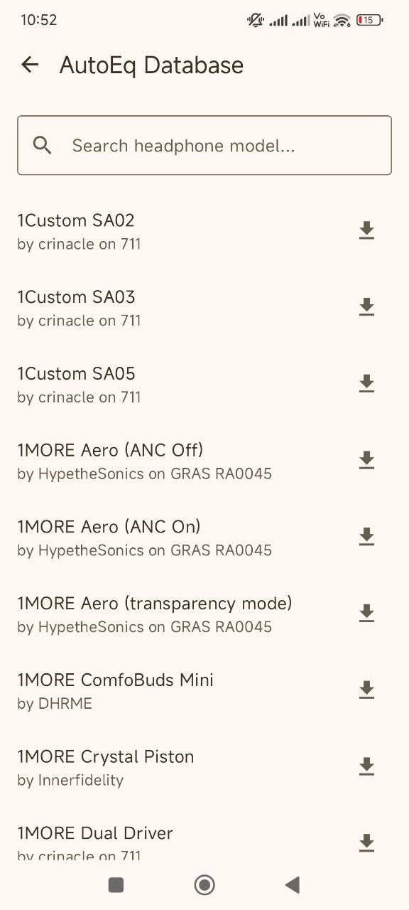
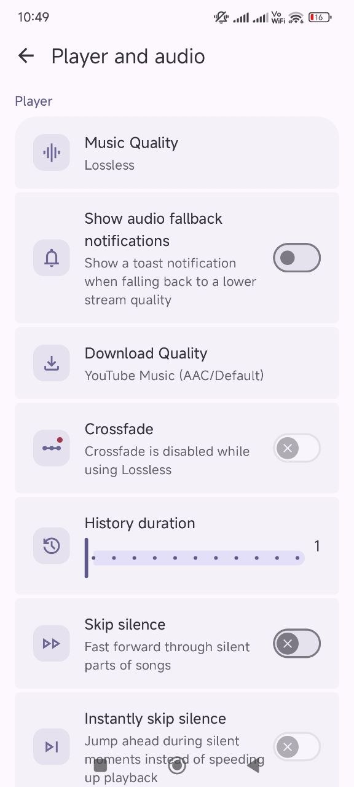
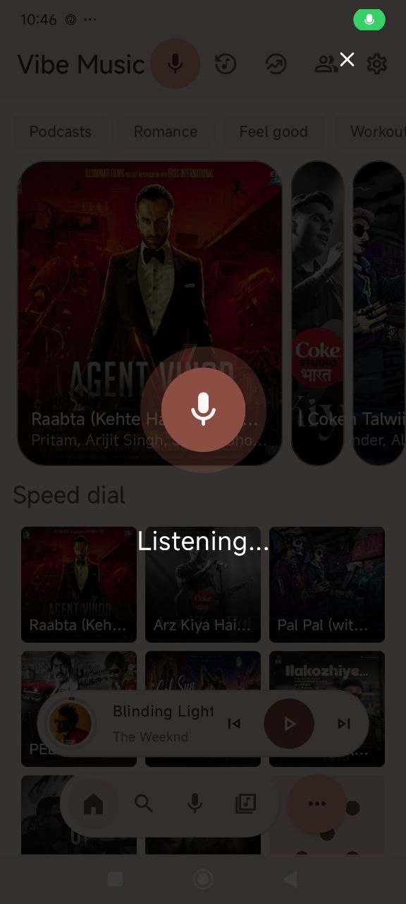

<p align="center">
  
</p>

<h1 align="center">Vibe Music</h1>

<p align="center">
  A free, ad-free music player for Android.<br>
  Synced lyrics, a real EQ, and a way to listen along with your friends.
</p>

<p align="center">
  <a href="https://github.com/iam4tharv/vibe-music/releases/latest/download/Vibemusic.apk"><b>Download APK</b></a>
  &nbsp;·&nbsp;
  <a href="https://t.me/vibemusicupdates">Telegram</a>
  &nbsp;·&nbsp;
  <a href="https://github.com/iam4tharv/Vibe-Music/issues">Report a bug</a>
</p>

<p align="center">
  
  
  
  
</p>

<p align="center">
  
</p>

---

## Why this exists

I wanted a music app that just plays music. No ads between songs, no being pushed toward whatever a algorithm decided I should hear next, and no paywall in front of basic things like lyrics or an equalizer.

So I started building one. Vibe Music is that app, and it's still growing. It's fully open source, and it'll stay free.

## Screenshots

<table>
  <tr>
    <td></td>
    <td></td>
    <td></td>
  </tr>
  <tr>
    <td></td>
    <td></td>
    <td></td>
  </tr>
  <tr>
    <td></td>
    <td></td>
    <td></td>
  </tr>
</table>

## What you get

**Listening**
- Streams from YouTube Music and Saavn (up to 320 kbps), with FLAC lossless where it's available
- Crossfade, skip silence, and swipe-to-queue
- Smart shuffle, Automix and Daily Discover for when you can't decide what to play
- A visualizer that reacts to the audio, on a translucent "liquid glass" UI

**Sound**
- Parametric EQ with AutoEQ built in, so you can pick your headphone model from a big profile database instead of guessing at sliders
- Volume on Google Cast devices follows your phone's hardware buttons

**Lyrics and discovery**
- Time-synced lyrics with a background that picks up colours from the album art
- Tap once to identify a song playing nearby (uses ShazamKit)
- Apple Music Top 100 and other charts inside the app
- **Vibee**, a voice assistant that helps you search, find music and manage the queue

**Together**
- **Listen Together**: join a room and everyone's playback stays in sync
- Android Auto and Wear OS support
- Home screen widgets, and "Recently Played" shows up in the system UI

**Your data stays yours**
- Export and import playlists, history and settings as a local JSON file

## Install

1. Grab [`Vibemusic.apk`](https://github.com/iam4tharv/vibe-music/releases/latest/download/Vibemusic.apk) from the latest release.
2. Open it on your phone. If Android complains, allow installs from unknown sources for your browser or file manager.

Updates and beta builds get posted in the [Telegram channel](https://t.me/vibemusicupdates).

## Building it yourself

You'll need a recent Android Studio.

```bash
git clone https://github.com/iam4tharv/Vibe-Music.git
cd Vibe-Music
./gradlew assembleDebug
```

The debug APK ends up in `app/build/outputs/apk/debug/`. If something fails to sync, open an issue and tell me which step broke.

## How Listen Together works

This was the hardest part to get right, so here's a quick tour for anyone reading the code.

- `ListenTogetherManager` listens to Media3 player events (play, pause, seek, track changes, timeline jumps) and turns them into room state that every device applies.
- `ListenTogetherClient` handles the networking. It uses OkHttp WebSockets plus Server-Sent Events for room management and signalling.
- `MusicService` exposes its player lifecycle hooks to the manager, so the sync logic doesn't have to fight the service.
- The manager is provided through `CompositionLocal` in `MainActivity`, which lets any screen control the room without passing it around by hand.

## Project layout

The app itself lives in `app/`. The rest of the top-level folders are separate Gradle modules, mostly one per data source or feature: `innertube` (YouTube Music), `lrclib`, `kugou`, `simpmusic`, `betterlyrics`, `paxsenixlyrics` and `youlyplus` for lyrics, `shazamkit` for recognition, and a few canvas modules for animated artwork.

## Help, feedback, ideas

Bugs and feature requests go in [Issues](https://github.com/iam4tharv/Vibe-Music/issues). If you'd rather chat, come say hi on [Telegram](https://t.me/vibemusicupdates).

## Support the project

Vibe Music has no ads and no premium tier, and I'd like to keep it that way. If it's become part of your day and you want to chip in, UPI works:

<p>
  <br>
  UPI ID: <code>dev.atharv@fam</code>
</p>

Totally optional. Telling a friend about the app helps just as much.

## License

Vibe Music is released under the [GPL-3.0](LICENSE).

## Legal stuff, in plain words

- **Free and non-commercial.** I don't sell the app or make money from it. There are no ads, subscriptions or hidden fees inside it. It started as a learning project and personal tool.
- **It's a client, not a host.** Vibe Music doesn't store or serve any audio or video. It reads publicly available YouTube and YouTube Music content and shows it in a different interface, much like a browser with an ad blocker would. Everything you hear is hosted by YouTube or the other providers and belongs to its owners.
- **Please support artists.** If you can, get [YouTube Premium](https://www.youtube.com/premium) or buy music you love. This project isn't meant to take money away from creators.
- **No warranty.** The software is provided "as is". I don't encourage piracy, and you're responsible for following your local copyright laws and the terms of the services you use.
- **Takedowns.** Since there's no hosted media here, there's nothing to take down on that side. For legal concerns about the source code itself, email [hello@iam4tharv.cyou](mailto:hello@iam4tharv.cyou).

---

<p align="center">Made by <a href="https://github.com/iam4tharv">@iam4tharv</a> for people who just want to listen.</p>
